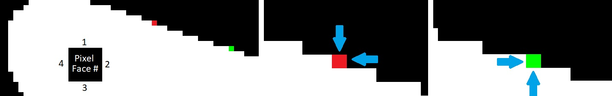

```{r setup, include=FALSE}
# You need to run the associated 'MIFoS - Data Analysis.R' file to
# generate and save the workspace for this Rmd file to work
load(file='./MIFoS - Data Analysis Workspace.RData')
library(tidyverse)
library(stringr)
library(caret)
library(matrixStats)  
library(rpart)
library(ModelMetrics) 
library(data.table)
library(httr)
library(corrplot)
library(pls)
library(grid)
library(gridExtra)
library(knitr)  

knitr::opts_chunk$set(echo = TRUE) 

```

## Introduction
<!-- an introduction/overview/executive summary section that describes the data set and summarizes the goal of the project and key steps that were performed; -->
Companies are increasingly relying on Computer-Aided Engineering in product development; some even devoting entire teams to the computational analysis of potential product designs. Recent Mechanical Engineering graduates are not only expected to be familiar with one or more of these tools, such as Finite Element Analysis and Computational Fluid Dynamics (CFD), but employers increasingly expect them to be capable of leveraging these approaches to make intelligent design decisions. While undergraduate (CFD) courses familiarize students with topics such as method derivation, domain creation, boundary conditions, mesh convergence, turbulence models, numerical convergence, and error analysis, they frequently do not have time to focus on higher level CFD skill and intuition development important to engineering analysis and design.

The MIFoS data set ('Machine Learning Driven Interpretation of Fluid Dynamics Simulations to Develop Student Intuition') was created as a first step towards addressing this deficiency in CFD education. Specifically the MIFoS data set was created to enable the creation of data-driven models and software aimed at minimizing pre-requesite CFD knowledge while developing higher level skills and intuition.  The MIFoS data set was created by collecting solution data from ~43,000 CFD simulations performed on programmatically-altered 2D geometries. Each entry in the MIFoS data set contains the solution data from a CFD simulation carried out on a 2D geometry derived from a smaller subset of original geometries. Simply put, 2D images were used as geometries in CFD simulations. The surface data from the original geometry was collected and then a single pixel on the object's surface was added or subtracted, after which a new CFD simulation was completed. The MIFoS data set represents ~43,000 distinct pixel additions/subtractions and their effects on aerodynamic drag and lift forces.

This report details two main approaches for using 2D CFD simulation data from an object's surface, the MIFoS data set, to train models for predicting the effect of pixel-based geometric changes on aerodynamic drag forces.  The first modeling and prediction approach calculates weights from polynomial models fit to surface data and drag relationships.  The second approach uses principal component regressions (PCR) fit to both the entire data set and separately to subsets of the data.  

\newpage 

## Analysis 
### Data Exploration and Cleaning
The data available from the MIFoS Github page is provided in two separate files, one containing the data set and a second containing all of the data headers. The dataset contains 137 variables for 43,418 rows, each of which represents solution data for a unique 2D geometry.  The variables for each observation include: 

* Geometry, Angle, and Pixel case integers (if connection to original geometry/angle is needed)
* Two booleans signifying if the observation is a geometric addition or subtraction (adding or removing a pixel)
* Four booleans representing which pixel faces were exposed to fluid flow (see Figure 1)
* Geometry modification (pixel change) X-coordinate
* Geometry modification (pixel change) Y-coordinate
* Original (unmodified) geometry drag components (x-y-z) corresponding to
    + Pressure drag
    + Viscous drag
    + Total drag 
* 27 integrated variables for 
    + Faces 1, 2, 3, & 4 (if exposed to fluid flow in original core or rotated geometry, see Figure 1) 
* Modified geometry drag delta (changes from original geometry) components (x-y-z) corresponding to 
    + Pressure drag
    + Viscous drag
    + Total drag 

```{r , echo=FALSE, fig.cap="Faces used for surface data collection when subtracting a pixel (middle, red - Faces 1 and 2) or adding a pixel (right, green - Faces 3 and 4) to a core geometry.", out.width = '100%'}

```

 
 
The majority of each observation (row) within the data set represents the surface data from an original geometry prior to a pixel-based geometry modification. Each geometric modification is the simple addition or subtraction of a pixel from the original geometry's surface.  The pressure, viscous, and total drag and lift data from the subsequent pixel-modified geometry is also included as the difference from the original geometry values. 

Across the entire set there are a total of 2,991,130 values set as 'NA'; many of these values are expected. Populating the data set with data only from populated pixel faces means that each unused subset of face data (27 variables) for that entry were left empty. However, not all of the NA values in the set are desired; any NA values in the drag delta columns represent simulations which errored out, did not properly converge, or were taking too long due to various simulation software issues. Out of the 43,418 rows, 65 of them contain NA values in the dragDelta columns meaning that these entries needed to be filtered out.

Once the obvious drag values errors (NA-wise) were removed, the drag force values in the X-direction (the focus of this analysis) were plotted. As seen from the following histogram on the left, there are very large drag values preventing any useful conclusions to be drawn regarding what type of distribution the remainder of the data creates. Each geometry was only changed by a single pixel with dimensions of 2% of the geometry's characteristic height.  From a fluid dynamics point of view, a relatively small geometric change at the given flow conditions (Re = 1) should not account for a large change in drag value. To identify and remove these large drag values, which are likely erroneous simulations, a cap of 15% of the average original geometry total drag force was implemented.  This means that any drag-delta, a change in drag due to a geometric change, was reported as larger than 15% of the average drag on an original geometry, then it was filtered out.  The histogram on the right shows us the resulting distribution.  There are still unexpectedly large drag-delta values, however, they are not the same physical impossibilities that the larger values represented.

```{r , echo=FALSE, warning=FALSE, fig.height = 3.75 }
p1 <- importedDataReduced %>% 
  ggplot(aes(`dragDeltas-TotalX`)) + 
  geom_histogram(bins = 30)+ 
  scale_y_log10()+ 
  ggtitle("Drag Distribution") +
  labs(x = "X-Direction Drag Force", y = "Simulation Counts" )  

ogDragMean <- 0.15 * mean(importedDataReduced$`originalGeometryDrag-TotalX`)
fluidIntuitionDataReduced <- importedDataReduced %>% 
  filter(abs(`dragDeltas-TotalX`) < ogDragMean)


p2 <- fluidIntuitionDataReduced %>% 
  ggplot(aes(`dragDeltas-TotalX`)) + 
  geom_histogram(bins = 30) + 
  scale_y_log10()+ 
  ggtitle("Drag - Outliers Removed") +
  labs(x = "X-Direction Drag Force", y = "Simulation Counts" ) 
grid.arrange(p1, p2, ncol=2)
```

To continue exploration of the data, a more traditional data-driven approach was used to remove outliers.  Where the previous 'fluid intuition' approach removed only ~20 outliers, using the 1.5xIQR (Interquartile Range) approach almost 3,000 entries were removed as outliers. The following histograms show a much cleaner data distribution. 


```{r , echo=FALSE, warning=FALSE, fig.height = 3.75 }
p1 <- dataDrivenDataReduced %>% 
  ggplot(aes(`dragDeltas-TotalX`)) + 
  geom_histogram(bins = 30) + 
  scale_y_log10()+ 
  ggtitle("Drag Distribution - 1.5xIQR") +
  labs(x = "X-Direction Drag Force", y = "Simulation Counts" ) 

p2 <- dataDrivenDataReduced %>% 
  ggplot(aes(`dragDeltas-TotalX`)) + 
  geom_histogram(bins = 30) +  
  ggtitle("Drag Distribution - 1.5xIQR") +
  labs(x = "X-Direction Drag Force", y = "Simulation Counts" ) 

grid.arrange(p1, p2, ncol=2)
```

### Train/Test/Validation Set Creation
The 'fluid intuition' approach was chosen over the 1.5xIQR approach for filtering data for two reasons. The first reason is that the 'fluid intuition' approach keeps drag values that are unexpectedly large, but not physically impossible.  The second reason is that the initially removed NA (~65 erroneous simulations) and the outliers identified through the 'fluids intuition' approach (~20 erroneous simulations) originate from how the CFD simulations were performed, or rather underperformed/diverged.  It is believed that these erroneous simulations could be dealt with and corrected by improving on the MIFoS CFD automation software which was developed to create the MIFoS data set.  The 1.5xIQR approach cannot be implemented without already knowing the drag values that are to be predicted.

Prior to creating train, test, and validation sets, a subset of imported data columns were identified as data that would provide unfair predictive power (dragDeltas for directions other than X-dir), act as pseudo-random noise to possibly complicate the analysis (face-area values and geometry/angle/pixel case numbers), or provide no information (originalGeometryDrag values for the Z-direction - all zeros).  Following the removal of these columns, 20% of the data set was stored as the validation set and the remainder was used for train/test sets.  Of the remaining train/test observations, 20% was used as a test set and the remainder was used as the train set.  The following table summarizes the counts, means, medians, and standard deviations for each data set.

```{r , echo=FALSE, results = 'asis'}
kable(dataSubsetComparison, caption = "Comparison of Original, Train, Test, and Validation Data Sets")
```

### The Challenge: Better Than Average
To determine accuracy or relative improvement for each model developed in this analysis, the mean dragDelta (x-direction) value was used as the baseline approach for prediction. 

\begin{center}
$RMSE_{mean}  = `r modelPerformance[1, 2]`$ 
\end{center}

### Approach 1: Polynomial Models
The approach used for the MovieLens project, detailed in the course text (@Irizarry2019) and expanded on in the previous course project, was used as the initial guide for this approach. However, due to the nature of the relationships between solution data and dragDeltas, weights were calculated using polynomial-based models.

As the first step for the polynomial model approach, the mean value was chosen as the basis for the preditive function to which all of the polynomial model driven weights would be added.  Mathmatically, the predictive function was chosen as:
$$Prediction_{poly }  = \mu + \sum_{n} w_{n} $$  
Where each weight $w_{n}$ was determined through a polynomial model based on the surface data from which it was fit. As with the approach used in the course text, the mean value and each weight were subtracted from the dragDelta values prior to the creation of the subsequent weight.

Following the removal of unusable columns from the train/test/validation data sets, there were 114 variables (+1 for drag values) remaining to be used in training models. To determine which variables would be useful in creating a polynomial model, the Pearson and Spearman correlation coefficients were calculated between each variable and the dragDelta values (with the mean removed). The correlations between the surface data and dragDelta values could be more complex than what the Pearson and Spearman correlations can represent, but the overlap between them suggested strong enough relationships to fit models. The following figure illustrates the Pearson and Spearman coefficients with values greater than 0.2.  This value was chosen to limit the number of variables to only those illustrating the strongest correlations.   
```{r , echo=FALSE, warning = FALSE, fig.height = 3.75 }
dataCorrelations <- PlotDragCorrelations(trainSet_preModels, magnitudeFilter = 0.2)
```

The derivative of the x-direction velocity with respect the x-direction integrated over face 2 (backwards-facing pixel surface), column name 'faceData-2-dx-velocity-dx', illustrated the strongest correlations.  The following figure was created to visualize the relationship between Face 2-du/dx and the dragDelta values.
```{r , echo=FALSE, warning = FALSE, fig.height = 3.75 }
PlotVariableVsDrag(trainSet_preModels, "faceData-2-dx-velocity-dx", "Face 2 - du/dx") 
```
After visually comparing various curve fits, $R^2$ values from different models were compared and a 5th order polynomial was chosen as a good option to model this relationship. The resulting model for this relationship is summarized as:
```{r, echo=FALSE  , warning = FALSE }
summary(model_f2_du_dx)
```


Prior to determining the best option for the next polynomial model based weight, the effects of the previous weight and the mean were subtracted from the dragDelta values.  Following the removal of the mean and Face 2 du/dx model effects, the Pearson and Spearman coefficients were recalculated to gain insight on the next most prominent relationship in the data.

```{r , echo=FALSE, warning = FALSE, fig.height = 3.75 }
dataCorrelations <- PlotDragCorrelations(trainSet_modelOne %>% select(-pred, -weight_f2_du_dx), magnitudeFilter = 0.2)
```

The same velocity derivative (du/dx), this time for Face 4, appeared to have the strongest correlation with dragDeltas. Visualizing the relationship between dragDelta and Face 4 du/dx we can see a similar, but reversed, distribution to the one observed for Face 2 du/dx. 

```{r , echo=FALSE, warning = FALSE, fig.height = 3.75 }
PlotVariableVsDrag(trainSet_modelOne, "faceData-4-dx-velocity-dx", "Face 4 - du/dx") 
```

The Face 4 - du/dx model was then fit and is summarized as:
```{r , echo=FALSE , warning = FALSE }
summary(model_f4_du_dx)
```

Following the removal of the mean and the effects of the Face 2 du/dx and Face 4 du/dx models, the Pearson and Spearman coefficients were recalculated to gain insight on the next most prominent relationship in the data.  Unfortunately, none of the relationships had correlation coefficients above the previously chosen threshold of 0.2. 

```{r , echo=FALSE, warning = FALSE, fig.height = 3.75 }
dataCorrelations <- PlotDragCorrelations(trainSetWithModels %>% 
                                           select(-pred, -weight_f2_du_dx, -weight_f4_du_dx), 
                                         magnitudeFilter = 0.075)
```

The largest correlation coefficients illustrated connections between dragDeltas and data originating from Faces 1 & 3, however, when the relationships were visualized they did not exhibit usable information.  The relationships illustrated either nearly horizontal relationships that were centered on the x-axis or discrete distributions due to the pixel-based characteristic of the object surfaces, as seen in the following figures. 
 
```{r , echo=FALSE, warning = FALSE }

p1 <- PlotVariableVsDrag(trainSetWithModels, "faceData-3-relative-velocity-angle", "Face 3 Rel. Vel. Angle") 
p2 <- PlotVariableVsDrag(trainSetWithModels, "faceData-3-dp-dx", "Face 3 dp-dx") 
p3 <- PlotVariableVsDrag(trainSetWithModels, "originalGeometryDrag-ViscousX", "OG Drag - Viscous") 
p4 <- PlotVariableVsDrag(trainSetWithModels, "originalGeometryDrag-PressureX", "OG Drag - Pressure") 

grid.arrange(p1, p2, p3, p4, ncol=2, nrow = 2)

```

Without any obvious data relationships that could be used to extend the polynomial weight prediction approach, the final polynomial weight prediction equation was set to:
$$Prediction_{poly }  = \mu +  w_{F2-du/dx} + w_{F4-du/dx} $$ 
 
Where $w_{F2-du/dx}$ and $w_{F4-du/dx}$ were calculated per observation using the trained polynomial models.

### Approach 2: Principal Component Regression
The second approach for predicting changes in drag based on geometric modifications uses Principal Component Regression (PCR).  PCR was chosen as it is known to perform well for situations in which there are a large number of correlated predictor variables. PCR is carried out by obtaining the singular value decomposition of the data set and using the principal components as regressors for the results. In terms of the MIFoS data, this means that SVD was carried out on the data containing surface data, the principal components of which were used as regressors for the dragDelta values.

The pls package (@pls2019) simplifies implementation of the PCR approach. When used in combination with the caret package (@caret2019), the caret 'train' function can be called with method set to 'pcr'.  While the MIFoS data set could be used when fitting polynomial models by pre-filtering out any entries in the respective columns that contained 'NA', the same could not be done for PCR. If set to ignore 'NA' values, for which there was at least 1 in every observation/entry of the MIFoS data, then the corresponding observation would be removed. Initial attempts using this approach resulted in trying to perform PCR on an empty data set.

To address the 'NA' entries for PCR, each column was first mean-centered and scaled. To achieve this, the mean and standard deviation for each column was calculated while ignoring 'NA' values.  The mean was then subtracted from its respective column and the remaining values were divided by their standard deviation. After the data was centered and scaled, all of the 'NA' values were then set to zero.  Following the replacement of 'NA' values, a PCR model was trained on the mean-centered and scaled data set using 10-fold cross-validation.

```{r , echo=FALSE, warning = FALSE, fig.height = 3.75 }
ggplot(pcrModel)  +
    ggtitle("PCR Model - Entire Data Set") 
```

Significant effort was put into the creation of the MIFoS dataset and the opportunity to explore principal component loadings for surface data was not neglected. The loading magnitudes were plotted vs the column names allowing for a simple comparison of the weight attributed to each variable for a given principal component.  

```{r , echo=FALSE, warning = FALSE, fig.height = 3.75 }
p1 <- pc1 %>% filter(abs(y) > 0.125) %>% mutate(y = abs(y)) %>% arrange(desc(y)) %>% slice(1:10) %>%
  ggplot(aes(x = reorder(x, abs(y)), abs(y))) + 
  geom_point()+
  labs(x = "Columns", y = "PC1 Loadings" ) +
  theme(axis.text.x = element_text(angle = 90))  

p2 <- pc2 %>% filter(abs(y) > 0.125) %>% mutate(y = abs(y)) %>% arrange(desc(y)) %>% slice(1:10) %>%
  ggplot(aes(x = reorder(x, abs(y)), abs(y))) + 
  geom_point()+
  labs(x = "Columns", y = "PC2 Loadings" ) +
  theme(axis.text.x = element_text(angle = 90)) 

grid.arrange(p1, p2 , ncol=2 )
```

Principal components 1 & 2 both illustrate the importance of surface data from Face 4, the initial face identified in the creation of the polynomial-weight approach.  The most prominent loadings do not emphasize the same variables identified using the Spearman and Pearson coefficients. Additionally, the variables with the largest loadings are counter-intuitive.  Faces 2 & 4 are oriented so that they are directly opposing (Face 4) or in the same direction as the fluid flow (Face 2). If the author had performed their own 'fluids intuition' prediction for which parameters would have had the most predictive power, it would have been pressure or pressure-derivative distributions on these faces (normal stresses).  The loadings from the first two principal components illustrate a different connection, the tangential (or shear) stresses and related velocity gradients are more effective as regressors than normal stresses.

The PCR RMSE vs Component plot also illustrates that the principal components which provide some of the largest drops in RMSE are not even in the top 10 principal components.  Specifically, principal components 19 and 70, among others, contribute to relatively large decreases in RMSE. Plotting the loadings for these components provides another set of intersting connections. The loadings for PC19 show a connection between surface data variables and whether the top and bottom faces are exposed to fluid flow prior to modification.  The loadings for PC70 show a strong connection to shear stress (or related velocity derivatives) for the top and bottom pixel faces (Faces 1 & 3).

```{r , echo=FALSE, warning = FALSE, fig.height = 3.75 }
p1 <- pc19 %>% filter(abs(y) > 0.125) %>% mutate(y = abs(y)) %>% arrange(desc(y)) %>% slice(1:10) %>%
  ggplot(aes(x = reorder(x, abs(y)), abs(y))) + 
  geom_point()+
  labs(x = "Columns", y = "PC19 Loadings" ) +
  theme(axis.text.x = element_text(angle = 90))  


p2 <- pc70 %>% filter(abs(y) > 0.125) %>% mutate(y = abs(y)) %>% arrange(desc(y)) %>% slice(1:10) %>%
  ggplot(aes(x = reorder(x, abs(y)), abs(y))) + 
  geom_point()+
  labs(x = "Columns", y = "PC70 Loadings" ) +
  theme(axis.text.x = element_text(angle = 90)) 

grid.arrange(p1, p2 , ncol=2 )
```

The plots for PC1 and PC2 illustrate a strong connection to whether or not a pixel is added or subtracted from the geometry. While the importance of whether a pixel is added or subtracted to a geometry may seem as it should be expected, it is more accurate in pointing out that using the data set without additive/subtractive separation is causing this variable combination to act as a confounder. The face data collected for a potential pixel addition would effectively be covered up after modification occurs. The face data collected for a potential pixel subtraction is directly acting on the pixel to be removed.

Following this realization the train set was split into additive and subtractive subsets. These subsets were then mean-centered and scaled using their respective means and standard deviations. PCR models were then trained for the two sets, visualized in the following RMSE vs Component plots.

```{r , echo=FALSE, warning = FALSE, fig.height = 3.5 }
p1 <- ggplot(additivePcr) +
    ggtitle("Additive PCR") 

p2 <- ggplot(subtractivePcr) +
    ggtitle("Subtractive PCR") 

grid.arrange(p1, p2 , ncol=2 )
```

Splitting the data between additive and subtractive subsets allowed for lower RMSE values, with the additive PCR model reaching a minimum at 91 components and the subtractive PCR model reaching a minimum at 98 components.  The initial component loadings of each subset were also affected, as seen from the following figures. While the first principal component for the additive PCR model relies on the original geometry forces and data from Face 3, the subtractive model relies more heavily on data captured on Face 4.

```{r , echo=FALSE, warning = FALSE, fig.height = 3.75 }
pc1Add <- data.frame(x = names(additivePcr$finalModel$loadings[,1]), 
                     y = additivePcr$finalModel$loadings[,1])
p1 <- pc1Add %>% filter(abs(y) > 0.125) %>% mutate(y = abs(y)) %>% arrange(desc(y)) %>% slice(1:10) %>%
  ggplot(aes(x = reorder(x, abs(y)), abs(y))) + 
  geom_point()+
  labs(x = "Columns", y = "Add. PC1 Loadings" ) +
  theme(axis.text.x = element_text(angle = 90))  

pc1Sub <- data.frame(x = names(subtractivePcr$finalModel$loadings[,1]), 
                     y = subtractivePcr$finalModel$loadings[,1])
p2 <- pc1Sub %>% filter(abs(y) > 0.125) %>% mutate(y = abs(y)) %>% arrange(desc(y)) %>% slice(1:10) %>%
  ggplot(aes(x = reorder(x, abs(y)), abs(y))) + 
  geom_point()+
  labs(x = "Columns", y = "Sub. PC1 Loadings" ) +
  theme(axis.text.x = element_text(angle = 90)) 

grid.arrange(p1, p2 , ncol=2 )
```
 

## Results
<!-- a results section that presents the modeling results and discusses the model performance; -->
Following the creation of the polynomial weight-based models and the principal component regressions, predictions were performed on the test set. The mean value from the train set was used as the baseline prediction and the polynomial models were used to calculate their respective weights based on surface data from the observations in the test set. To create the PCR models, the mean and standard deviation from each column of the train set, and subsequently in the additive/subtractive train set split, were calculated for mean-centering and scaling.  These same values were used to mean-center and scale the test data prior to using the test set values as new data into each PCR model.  Following prediction using the PCR models, the normalized prediction value was multiplied by the standard deviation and added to the mean prior to RMSE calculation. The single weight approach provided an improvement over the mean by approximately 3.5% while the two weight approach nearly doubled the improvement to 6.75%.  The PCR models both outperformed the polynomial weight models, but the additive/subtractive split PCR model provided the best improvement in RMSE.

```{r , echo=FALSE, results = 'asis'}
kable(modelPerformance  , 
      caption = "Model Performance on Test Set")
```

During model creation, the code used to download and split the train, test, and validation data sets was re-run occassionally when the R workspace/environment needed to be reset or restarted.  This undoubtedly caused information to be transfered to and from the validation set, however, it also pointed out an issue in working with a relatively small dataset.  The mean and standard deviations for each subset of data initially varied considerably which caused the models to have considerably different performance from one run-through to the next.  While the data sets had initially been compared earlier in the analysis, the initial runs had provided means, medians, and standard deviations that were quite close.  After repeatedly reprocessing only the data splits, the variability in the following table was surprisingly high, around ~30% (of the magnitude of the mean) between train, test, and validation sets.  To address this, additional arguments were used within the Caret 'createDataPartition' function which helped in providing more consistent results across the data subsets. 

```{r , echo=FALSE, results = 'asis'}
kable(dataSubsetComparison  , 
      caption = "Train, Test, and Validation Set Stats")
```

Following the modification of appropriate functions to subdivide the MIFoS data set into subsets which more closely represent the original dataset, the data subsets were temporarily stored and used during the remainder of the model creation process.  Testing performance on the validation set was saved as the final step. Based on the Mean, Median, and Standard Deviations obtained for the data subsets, it was expected that performance would be as good or better for the validation set than that for the test set because the mean, median, and standard deviation are closer to the train set on which the models were fit.   

```{r , echo=FALSE, results = 'asis', warning=FALSE}

######### Test polynomial models

validationResults <- validationSet %>% 
  mutate(pred_mean = mu,
         weight_f2_du_dx = predict(model_f2_du_dx, 
                                   newdata = data.frame(
                                     x = `faceData-2-dx-velocity-dx`),
                                   na.action = na.pass),
         pred_oneWeight = mu + ifelse(!is.na(weight_f2_du_dx), weight_f2_du_dx, 0),
         weight_f4_du_dx = predict(model_f4_du_dx, 
                                   newdata = data.frame(
                                     x = `faceData-4-dx-velocity-dx`),
                                   na.action = na.pass),
         pred_twoWeight = mu + 
           ifelse(!is.na(weight_f4_du_dx), weight_f4_du_dx, 0) +
           ifelse(!is.na(weight_f2_du_dx), weight_f2_du_dx, 0)
  )

validationPerformance <- data.frame(Models = c("Mean", "Mean + F2 du-dx", "Mean + F2 du-dx + F4 du-dx"),
                               RMSE = c(rmse(validationResults$dragDeltaX, validationResults$pred_mean),
                                        rmse(validationResults$dragDeltaX, validationResults$pred_oneWeight),
                                        rmse(validationResults$dragDeltaX, validationResults$pred_twoWeight)
                               ))
valMeanRmse <- rmse(validationResults$dragDeltaX, validationResults$pred_mean)
validationPerformance <- validationPerformance %>%
  mutate(PercentImprovement = (valMeanRmse - RMSE) / valMeanRmse * 100)


####### Test PCR for entire set
valPcrPredictions <- PredictDrag(pcrModel, validationSet, trainMeans, trainStdDev)

valPcrPredictions <- valPcrPredictions * dragStdDev + dragMean


valPcrRmse <- rmse(validationSet$dragDeltaX, valPcrPredictions)
validationPerformance <- bind_rows(validationPerformance, 
                              data.frame(Models = "PCR",
                                         RMSE = valPcrRmse,
                                         PercentImprovement = 100 *(valMeanRmse - valPcrRmse) /valMeanRmse))


######### Test Add/Sub PCR 
additiveValSet <- validationSet %>% 
  filter(isPixelAdded == 1) %>%
  select(-isPixelAdded, -isPixelSubtracted)
subtractiveValSet <- validationSet %>% 
  filter(isPixelSubtracted == 1) %>%
  select(-isPixelAdded, -isPixelSubtracted)

valAddPredictions <- PredictDrag(additivePcr, additiveValSet, addMeans, addStdDev)
valSubPredictions <- PredictDrag(subtractivePcr, subtractiveValSet, subMeans, subStdDev)

valAddPredictions <- valAddPredictions * addDragStdDev + addDragMean
valSubPredictions <- valSubPredictions * subDragStdDev + subDragMean

valPred <- c(valAddPredictions, valSubPredictions)
valDrag <- c(additiveValSet$dragDeltaX, subtractiveValSet$dragDeltaX)

valAdditiveRSME <- rmse(valAddPredictions, additiveValSet$dragDeltaX)
valSubtractiveRSME <- rmse(valSubPredictions, subtractiveValSet$dragDeltaX)

valAddSubPcrRmse <- rmse(valDrag, valPred)

validationPerformance <- bind_rows(validationPerformance, 
                              data.frame(Models = "Add/Sub Split PCR",
                                         RMSE = valAddSubPcrRmse,
                                         PercentImprovement = 100 *(valMeanRmse - valAddSubPcrRmse) /valMeanRmse))


kable(validationPerformance  , 
      caption = "Model Performance on Validation Set")
```

Despite the closer mean, median, and standard deviation between the train and validation sets than with the test set, the models did not perform as strongly on the validation set. All of the models saw a drop in performance, but the Additive-Subtractive split PCR model saw the largest drop in performance.  We can examine this more closely by taking a look at the performance of the Additive PCR model vs the Subtractive PCR model. 

```{r , echo=FALSE, results = 'asis', warning=FALSE}
addSubRmseComparison <- data.frame(Model = c("Additive PCR", "Subtractive PCR"), 
                                   Test_RMSE = c(additiveRSME, subtractiveRSME), 
                                   Val_RMSE = c(valAdditiveRSME, valSubtractiveRSME))
kable(addSubRmseComparison  , 
      caption = "Additive vs Subtractive Performance")
```

While the RMSE values for the Additive PCR model were almost identical between the test and validation sets, the RMSE for the subtractive model was substantially worse for the validation set. The original data partitions were performed on the entire data set.  As seen from previous partitioning complications, splitting relatively small data sets so that they have equally representative data is not necessarily easy.  This problem was likely exacerbated for the additive/subtractive PCR approach by splitting the MIFoS data using the drag delta values with no considerations for whether pixels were added or subtracted.

## Conclusions
<!-- a conclusion section that gives a brief summary of the report, its limitations, and future work (the last two are recommended but not necessary). -->
Computational engineering software, such as Computational Fluid Dynamics, has become and integral part of the product design process and employers want graduates capable of leveraging these tools. The MIFoS data set was created to enable higher level CFD-driven design skills and intuition through the creation of models capable of predicting changes in drag and lift forces. This analysis focused on two modeling approaches which used solution surface data for the prediction of drag changes due to geometric modifications; a step closer to creating a CFD-driven design tutor for undergraduate students. Specifically, the models involved (1) formulating a weight-based equation leveraging polynomial models and (2) fitting principal component regressions. The initial data cleaning process involved indentifying erroneous observations and obvious outliers in the data set. Correlation coefficients were used to identify key variables which were then used to train two polynomial models. The polynomial models were capable of providing ~3.5% and ~6.0% improvements in RMSE over the training set mean value. The data was then mean-centered and scaled to permit the training of principal component regressions. A PCR model fit to the entire data set provided ~10% improvement in RMSE over the mean, while PCR models fit to separate geometric modification approachs (additive vs subtractive) only provided ~8.5% improvement over the mean. Despite the improvements in RMSE gained through the development of polynomial and PCR models, the RMSE remains on the same order of magnitude as the standard deviation for the entire data set. Substantial reductions of the RMSE through model refinement or alternative approaches are needed in order to use the MIFoS data for its intended application.

The MIFoS data set was originally created by identifying a range of 2D geometries that would provide a diverse set of results.  Partitioning the MIFoS data into train, test, and validation sets representative of the original set and representative of what is expected from arbitrary student submissions is important for model creation and real-world performance.  Additional considerations per observation for additive vs subtractive modifications as well as face-population (which faces contained data for a given pixel) should be considered when partitioning data in future attempts.  This would allow for improvement of split additive vs subtractive models while also enabling the creation of face-centric models (Faces 1 vs 2 vs 3 vs 4). Further exploration could also be conducted with one or more variables in polynomial models which vary by additive vs subtractive methods and/or by faces. 

 


 
 